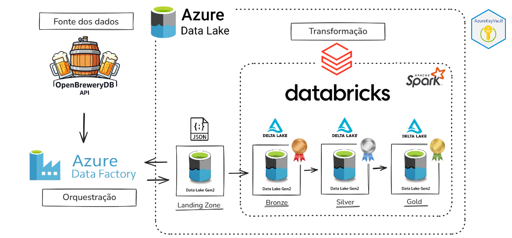
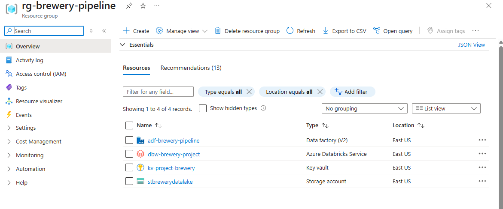
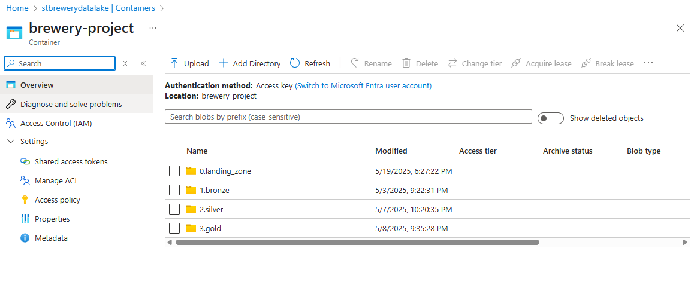
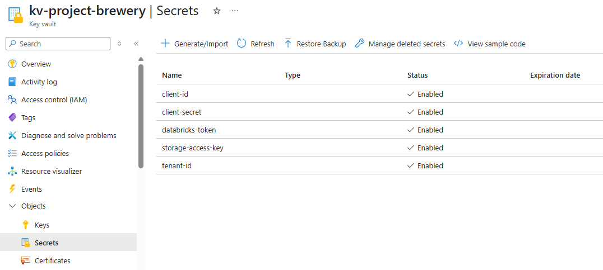
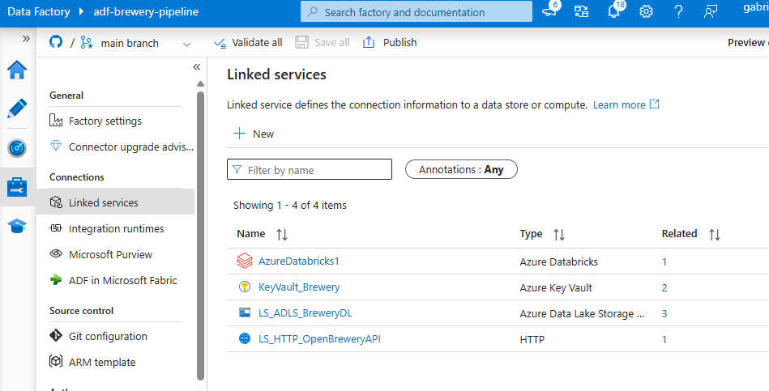
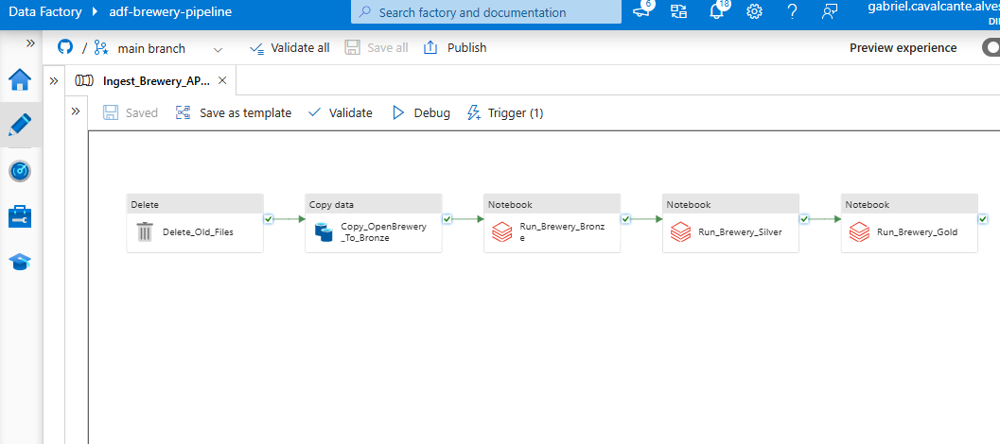
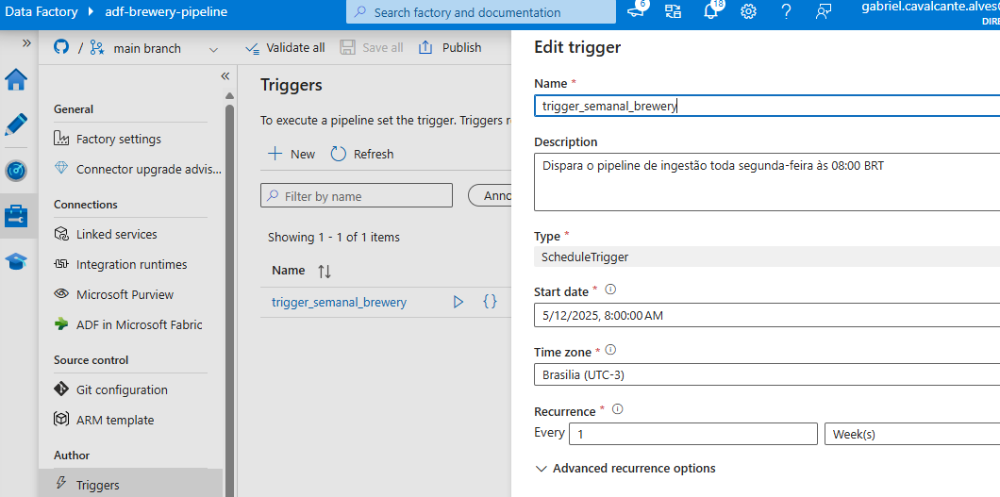
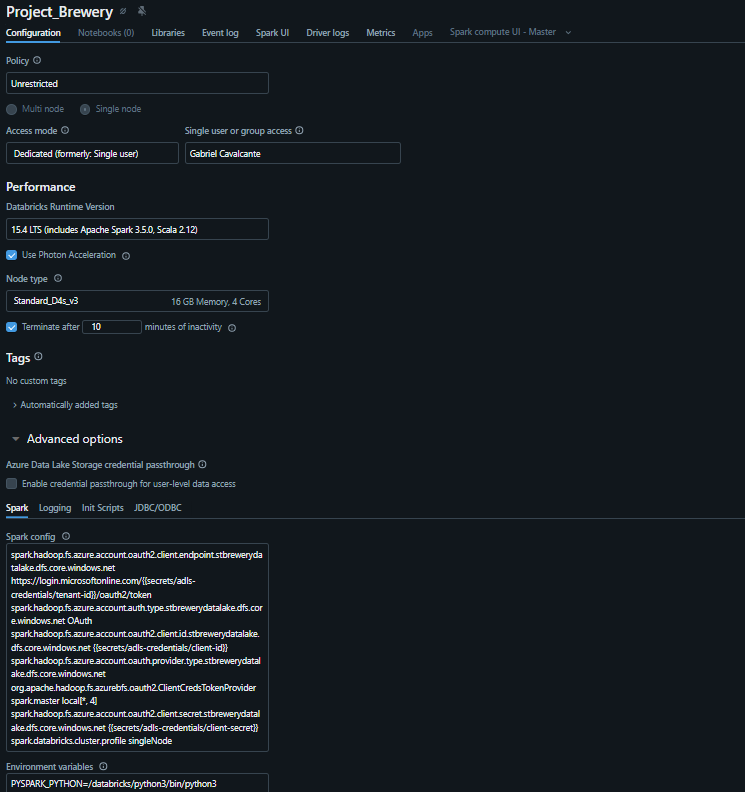
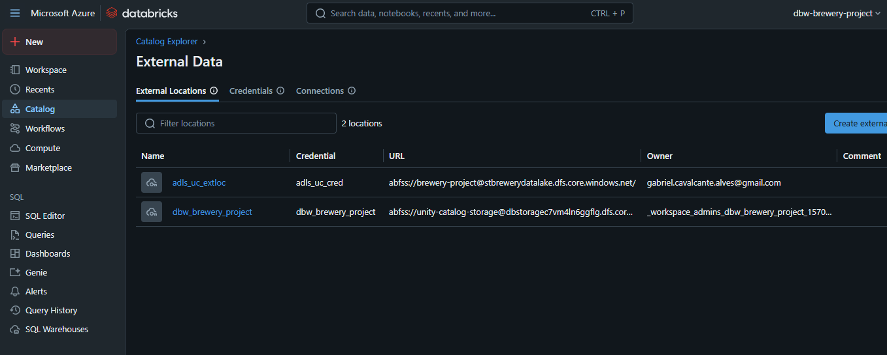

# 🍺 OpenBreweryDB - Azure Data Engineering Pipeline

Este projeto implementa uma pipeline de engenharia de dados moderna na Azure, utilizando a API pública [OpenBreweryDB](https://www.openbrewerydb.org/) como fonte de dados. O fluxo contempla ingestão, tratamento e análise de dados em múltiplas camadas (Landing → Bronze → Silver → Gold), com recursos como versionamento no Git, segurança com Key Vault, e processamento distribuído via Databricks.

---

## 📌 Objetivo

Demonstrar a criação de uma arquitetura escalável e segura de engenharia de dados usando ferramentas nativas da Azure, com ênfase em boas práticas de particionamento, controle de acesso, versionamento e governança de dados.

---

## 🧱 Arquitetura da Solução

> Arquitetura baseada nos serviços da Azure: ADF, Databricks, ADLS Gen2 e Key Vault, com integração por Managed Identity e pipelines versionadas com GitHub.

---

## 📸 Prints do Projeto

Abaixo, imagens que mostram as etapas práticas de construção do projeto:

| Etapa | Imagem |
|-------|--------|
| 🔹 Criação do grupo de recursos |  |
| 🗃️ Criação da Storage Account (ADLS Gen2) |  |
| 🔑 Criação do Key Vault |  |
| 🔌 Configuração dos Linked Services |  |
| 🧪 Criação do Pipeline no ADF |  |
| 🔁 Criação do Trigger no ADF |  |
| ⚙️ Criação do Cluster no Databricks |  |
| 🚀 Criação do External Data no Catalog Explorer no Databricks |  |

---

## 🔧 Tecnologias e Serviços Utilizados

- **Azure Data Factory (ADF)**: Orquestração das atividades de ingestão e transformação.
- **Azure Data Lake Storage Gen2 (ADLS)**: Armazenamento estruturado por camadas.
- **Azure Key Vault**: Armazenamento seguro de segredos e autenticações.
- **Azure Databricks (Spark)**: Processamento, transformação e criação de tabelas Delta.
- **Delta Lake / Unity Catalog**: Gerenciamento de tabelas, versionamento e otimização.
- **GitHub**: Versionamento dos pipelines e notebooks (integração nativa com o ADF).

---

## 🔄 Pipeline em Camadas

### **📥 Landing Zone**
- Pasta temporária para armazenamento inicial do JSON da API.
- Atividade `Delete_Old_Files` remove arquivos antigos.

### **🥉 Bronze**
- Ingestão via API pública com `CopyActivity`.
- Armazenamento em formato JSON.
- Notebook `brewery_bronze.py` transforma em Delta Table com `ingest_timestamp`.

### **🥈 Silver**
- Notebook `brewery_silver.py` realiza:
  - Padronização de endereços com lógica condicional (`address_1`/`address_2`).
  - Seleção de colunas relevantes.
  - Adição de `silver_timestamp`.
  - Comentários nas colunas via SQL.
  - Otimização da tabela com `OPTIMIZE`.

### **🥇 Gold**
- Notebook `brewery_gold.py` gera análises agregadas:
  - Cervejarias por tipo e cidade
  - Cervejarias por tipo
  - Cervejarias por estado e cidade
  - Cervejarias por país e estado
  - Cervejarias por cidade
- Escrita em Delta Table e otimização automática.

---

## ⏱️ Automação e Orquestração

- Pipeline orquestrada no **ADF**: `Ingest_Brewery_API_to_Bronze`
- Agendamento com trigger semanal (`ScheduleTrigger`)
- Uso de Managed Identity para acessar com segurança o Key Vault
- Linked Services configurados para API, Key Vault, Databricks e ADLS

---

## 🔐 Segurança

- **Azure Key Vault** com secrets armazenando:
  - `client-id`, `client-secret`, `tenant-id`
  - `storage-access-key`
  - `databricks-token`
- **Managed Identities** atribuídas ao ADF e Databricks
- Integração com Unity Catalog para governança de acessos

---

## ✅ Resultados

- Tabelas Delta organizadas em três camadas
- Transformações reutilizáveis em notebooks PySpark e Spark SQL
- Dados otimizados para consultas analíticas e BI
- Projeto versionado com GitHub via integração com ADF
- Projeto pronto para ser integrado ao Power BI, Synapse ou dashboards em tempo real

---

## 🧠 Conhecimentos Demonstrados

- ✔️ Data Lake e particionamento estratégico
- ✔️ Orquestração e automação de pipelines com ADF
- ✔️ Processamento distribuído com Apache Spark
- ✔️ Uso de Delta Lake com comentários, otimizações e versionamento
- ✔️ Governança de dados com Unity Catalog e Key Vault
- ✔️ Estrutura em camadas (Landing > Bronze > Silver > Gold)
- ✔️ Integração contínua via GitHub com ADF

